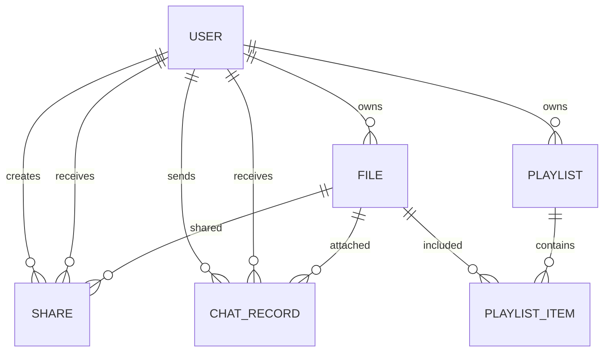

# 局域网文件传输助手（LanFileHub）数据库设计文档

## 1. 数据库概述

本数据库设计基于SQLite，用于存储局域网文件传输助手的用户信息、文件信息、共享信息、聊天记录和播放列表等数据。数据库采用关系型设计，通过外键关联不同表之间的关系，确保数据的完整性和一致性。

## 2. 数据库表结构

### 2.1 用户表（users）

| 字段名 | 数据类型 | 约束 | 描述 |
|-------|---------|------|------|
| id | INTEGER | PRIMARY KEY, INDEX | 用户ID |
| username | VARCHAR(50) | UNIQUE, NOT NULL, INDEX | 用户名 |
| password_hash | VARCHAR(255) | NOT NULL | 密码哈希值 |
| nickname | VARCHAR(50) | NOT NULL | 昵称 |
| email | VARCHAR(100) | UNIQUE | 邮箱 |
| avatar | VARCHAR(255) | | 头像路径 |
| created_at | DATETIME | DEFAULT CURRENT_TIMESTAMP | 创建时间 |
| updated_at | DATETIME | DEFAULT CURRENT_TIMESTAMP, ON UPDATE CURRENT_TIMESTAMP | 更新时间 |
| is_active | BOOLEAN | DEFAULT TRUE | 是否激活 |
| is_admin | BOOLEAN | DEFAULT FALSE | 是否管理员 |

### 2.2 文件表（files）

| 字段名 | 数据类型 | 约束 | 描述 |
|-------|---------|------|------|
| id | INTEGER | PRIMARY KEY, INDEX | 文件ID |
| filename | VARCHAR(255) | NOT NULL | 文件名 |
| file_path | VARCHAR(500) | NOT NULL | 文件存储路径 |
| file_size | FLOAT | NOT NULL | 文件大小（字节） |
| file_type | VARCHAR(50) | NOT NULL | 文件类型 |
| user_id | INTEGER | FOREIGN KEY(users.id), NOT NULL | 所属用户ID |
| folder_path | VARCHAR(500) | NOT NULL, DEFAULT '/' | 文件夹路径 |
| is_public | BOOLEAN | DEFAULT FALSE | 是否公开 |
| is_deleted | BOOLEAN | DEFAULT FALSE | 是否删除 |
| created_at | DATETIME | DEFAULT CURRENT_TIMESTAMP | 创建时间 |
| updated_at | DATETIME | DEFAULT CURRENT_TIMESTAMP, ON UPDATE CURRENT_TIMESTAMP | 更新时间 |

### 2.3 共享表（shares）

| 字段名 | 数据类型 | 约束 | 描述 |
|-------|---------|------|------|
| id | INTEGER | PRIMARY KEY, INDEX | 共享ID |
| file_id | INTEGER | FOREIGN KEY(files.id), NOT NULL | 文件ID |
| creator_id | INTEGER | FOREIGN KEY(users.id), NOT NULL | 创建者ID |
| receiver_id | INTEGER | FOREIGN KEY(users.id) | 接收者ID（可选） |
| share_code | VARCHAR(50) | UNIQUE, NOT NULL, INDEX | 共享码 |
| is_public | BOOLEAN | DEFAULT FALSE | 是否公开共享 |
| expires_at | DATETIME | | 过期时间（可选） |
| created_at | DATETIME | DEFAULT CURRENT_TIMESTAMP | 创建时间 |

### 2.4 聊天记录表（chat_records）

| 字段名 | 数据类型 | 约束 | 描述 |
|-------|---------|------|------|
| id | INTEGER | PRIMARY KEY, INDEX | 记录ID |
| sender_id | INTEGER | FOREIGN KEY(users.id), NOT NULL | 发送者ID |
| receiver_id | INTEGER | FOREIGN KEY(users.id), NOT NULL | 接收者ID |
| message | TEXT | NOT NULL | 消息内容 |
| message_type | VARCHAR(20) | DEFAULT 'text' | 消息类型（text, file, image） |
| file_id | INTEGER | FOREIGN KEY(files.id) | 文件ID（可选） |
| read_status | BOOLEAN | DEFAULT FALSE | 已读状态 |
| created_at | DATETIME | DEFAULT CURRENT_TIMESTAMP | 创建时间 |

### 2.5 播放列表表（playlists）

| 字段名 | 数据类型 | 约束 | 描述 |
|-------|---------|------|------|
| id | INTEGER | PRIMARY KEY, INDEX | 播放列表ID |
| name | VARCHAR(100) | NOT NULL | 播放列表名称 |
| user_id | INTEGER | FOREIGN KEY(users.id), NOT NULL | 所属用户ID |
| description | TEXT | | 描述 |
| is_public | BOOLEAN | DEFAULT FALSE | 是否公开 |
| created_at | DATETIME | DEFAULT CURRENT_TIMESTAMP | 创建时间 |
| updated_at | DATETIME | DEFAULT CURRENT_TIMESTAMP, ON UPDATE CURRENT_TIMESTAMP | 更新时间 |

### 2.6 播放列表项表（playlist_items）

| 字段名 | 数据类型 | 约束 | 描述 |
|-------|---------|------|------|
| id | INTEGER | PRIMARY KEY, INDEX | 播放列表项ID |
| playlist_id | INTEGER | FOREIGN KEY(playlists.id), NOT NULL | 播放列表ID |
| file_id | INTEGER | FOREIGN KEY(files.id), NOT NULL | 文件ID |
| order_index | INTEGER | NOT NULL, DEFAULT 0 | 排序索引 |
| added_at | DATETIME | DEFAULT CURRENT_TIMESTAMP | 添加时间 |

## 3. 数据库关系图

## 4. 数据模型设计

### 4.1 用户模型（User）
- 管理用户账户信息
- 支持用户认证和授权
- 关联用户的文件、共享、聊天记录和播放列表

### 4.2 文件模型（File）
- 存储文件元数据
- 关联用户和共享信息
- 支持文件状态管理（公开/私有、删除/未删除）

### 4.3 共享模型（Share）
- 管理文件共享信息
- 支持公开和私有共享
- 支持设置过期时间

### 4.4 聊天记录模型（ChatRecord）
- 存储用户间的聊天消息
- 支持文本和文件消息
- 记录消息的发送、接收和阅读状态

### 4.5 播放列表模型（Playlist）
- 管理用户创建的播放列表
- 支持公开和私有播放列表
- 关联播放列表项

### 4.6 播放列表项模型（PlaylistItem）
- 存储播放列表中的文件项
- 支持排序功能

## 5. 数据库初始化

### 5.1 初始化脚本
- 创建数据库表结构
- 初始化管理员用户
- 设置默认配置

### 5.2 初始数据
- 管理员账户：用户名 `admin`，密码 `admin123`

## 6. 性能优化考虑

1. **索引优化**：在常用查询字段上创建索引，如用户名字段、共享码字段等
2. **外键约束**：使用外键约束确保数据一致性
3. **事务管理**：使用事务确保数据操作的原子性
4. **数据清理**：定期清理过期的共享和已删除的文件

## 7. 安全性考虑

1. **密码存储**：使用bcrypt对密码进行哈希处理
2. **权限控制**：基于用户角色的权限控制
3. **数据验证**：在应用层对输入数据进行验证
4. **SQL注入防护**：使用ORM避免SQL注入攻击

## 8. 总结

本数据库设计采用SQLite作为存储引擎，适合局域网环境下的轻量级应用。通过合理的表结构设计和关系定义，满足了局域网文件传输助手的功能需求，包括用户管理、文件管理、共享管理、聊天功能和多媒体播放列表管理。

数据库设计考虑了性能优化和安全性，确保系统在局域网环境下能够稳定运行，同时提供良好的用户体验。
