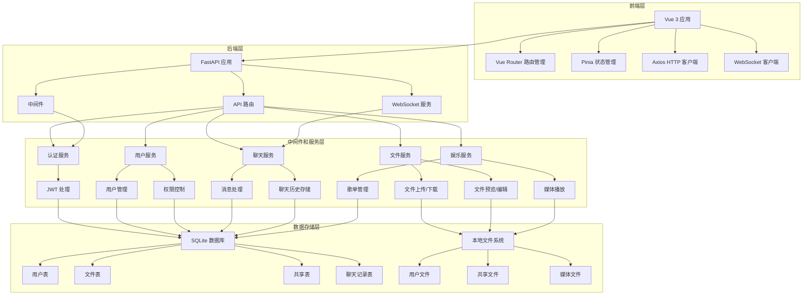

# 局域网文件传输助手（LanFileHub）技术选型文档

## 1. 项目概述

本项目是一个部署在局域网环境下的文件传输与管理平台，支持文件暂存、用户空间管理、文件在线预览与编辑、多媒体娱乐共享、点对点聊天等功能。目标用户为局域网内的企业员工、家庭用户、小团队成员。

## 2. 技术选型

### 2.1 后端技术选型

| 技术选项 | 选择结果 | 选型理由 |
|---------|---------|--------|
| FastAPI | ✅ | - 高性能：基于 Starlette 和 Pydantic，性能接近 Node.js 和 Go - 自动生成 API 文档：无需额外配置，自动生成交互式 API 文档 - 类型提示：基于 Python 类型注解，提供更好的代码提示和类型检查 - 异步支持：原生支持异步处理，适合高并发场景 - 轻量级：易于部署和维护，适合局域网环境 |
| Express | ❌ | - 虽然性能优异，但需要额外配置 API 文档 - 类型系统不如 FastAPI 完善 - 对于 Python 生态系统的集成不如 FastAPI 便捷 |

### 2.2 前端技术选型

| 技术选项 | 选择结果 | 选型理由 |
|---------|---------|--------|
| Vue 3 | ✅ | - 轻量级：核心库体积小，加载速度快 - 响应式系统：基于 Proxy 的响应式系统，性能优异 - 简洁的模板语法：易于学习和使用 - 成熟的生态系统：丰富的第三方库和组件 - 适合构建响应式 Web 界面：支持 PC/移动端浏览器 |
| React | ❌ | - 学习曲线较陡峭 - 状态管理相对复杂 - 构建体积较大，可能影响页面加载速度 |

## 3. 系统架构图

## 4. 技术栈和依赖库

### 4.1 后端技术栈

| 技术/依赖 | 版本 | 用途 |
|----------|------|------|
| Python | 3.9+ | 基础编程语言 |
| FastAPI | 0.104.1+ | Web 框架 |
| Uvicorn | 0.24.0+ | ASGI 服务器 |
| SQLAlchemy | 2.0.23+ | ORM 框架 |
| SQLite | 3.35.0+ | 数据库 |
| Pydantic | 2.5.0+ | 数据验证 |
| JWT | 2.8.0+ | 身份认证 |
| WebSocket | - | 实时通信 |
| Aiofiles | 23.2.1+ | 异步文件操作 |
| python-multipart | 0.0.6+ | 文件上传处理 |

### 4.2 前端技术栈

| 技术/依赖 | 版本 | 用途 |
|----------|------|------|
| Vue 3 | 3.3.0+ | 前端框架 |
| Vite | 5.0.0+ | 构建工具 |
| Vue Router | 4.2.0+ | 路由管理 |
| Pinia | 2.1.0+ | 状态管理 |
| Axios | 1.6.0+ | HTTP 客户端 |
| WebSocket | - | 实时通信 |
| Element Plus | 2.4.0+ | UI 组件库 |
| VueUse | 10.7.0+ | 实用工具集 |
| Video.js | 8.3.0+ | 视频播放器 |
| Howler.js | 2.2.3+ | 音频播放器 |

## 5. 部署和集成方案

### 5.1 部署环境
- **操作系统**：Windows 10/11、Linux（Ubuntu/CentOS）
- **硬件要求**：
  - CPU：至少 2 核心
  - 内存：至少 4GB
  - 存储：根据实际需求配置
  - 网络：局域网环境，带宽充足

### 5.2 部署方式
1. **一键启动**：提供可执行文件，双击即可启动
2. **命令行运行**：通过命令行启动服务
3. **服务化部署**：在 Linux 环境下配置为系统服务

### 5.3 集成方案
- **Office 在线编辑**：集成 OnlyOffice 或 Collabora
- **文件预览**：使用浏览器原生支持或第三方库
- **多媒体播放**：使用 Video.js 和 Howler.js
- **实时通信**：使用 WebSocket

## 6. 技术选型总结

### 6.1 优势
- **高性能**：FastAPI 的异步处理和 Vue 3 的响应式系统确保系统性能优异
- **易于部署**：轻量级技术栈，适合局域网环境
- **开发效率高**：FastAPI 的自动 API 文档和 Vue 3 的简洁语法提高开发效率
- **可扩展性**：模块化设计，便于功能扩展
- **安全性**：内置的认证和权限控制机制

### 6.2 风险评估
- **文件存储**：本地文件系统存储可能存在数据安全风险，需要定期备份
- **Office 在线编辑**：集成第三方服务可能增加部署复杂度
- **大文件传输**：需要实现分片上传/断点续传功能
- **并发性能**：需要优化数据库和文件系统操作以支持高并发

### 6.3 结论

基于项目需求和技术评估，选择 FastAPI 作为后端框架和 Vue 3 作为前端框架是最优选择。这一技术栈组合能够满足项目的功能需求，同时提供良好的性能和开发体验。系统架构设计合理，技术栈和依赖库选择恰当，为项目的成功实施奠定了基础。